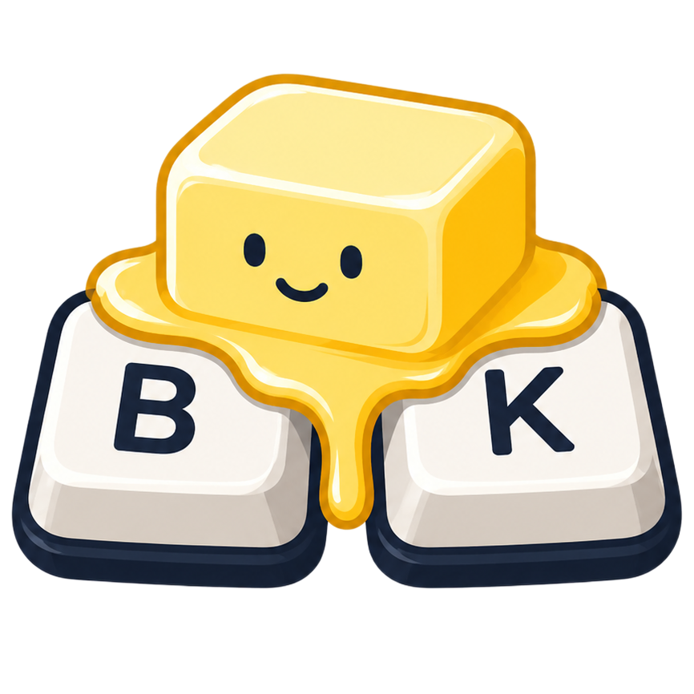

# ButterKeys

<p align="center">
  
</p>

**Typing, but smoother.**

ButterKeys is a local-first macOS menu bar app that corrects recurring personal typing mistakes in real time. It focuses on motor-pattern slips (`teh` → `the`, `writign` → `writing`, `int he` → `in the`) rather than generic cloud spellchecking.

Everything runs on your Mac. No accounts, no analytics, no network required for correction.

## Requirements

- macOS 14 or newer
- Xcode 16+ (Swift 6)
- [XcodeGen](https://github.com/yonaskolb/XcodeGen) (`brew install xcodegen`)
- Apple Silicon preferred (Intel desirable where practical)

## Setup

```bash
git clone <repo-url> timbenniks-butterkeys
cd timbenniks-butterkeys
xcodegen generate
open ButterKeys.xcodeproj
```

Build and run the **ButterKeys** scheme. Grant **Input Monitoring** and **Accessibility** when prompted (System Settings → Privacy & Security).

### Important: permissions while developing

Apps launched with **Xcode → Run** live under DerivedData. macOS often will **not** list them reliably under Accessibility / Input Monitoring, or the entry breaks after every rebuild.

For permission testing, install a stable copy:

```bash
chmod +x scripts/install-dev.sh
./scripts/install-dev.sh
```

That builds and copies **ButterKeys.app** to `/Applications/ButterKeys.app`. Then:

1. Open **ButterKeys from /Applications** (not Xcode)
2. System Settings → Privacy & Security → **Input Monitoring** → enable ButterKeys
3. Same for **Accessibility** (use **+** and pick `/Applications/ButterKeys.app` if it is missing)
4. Quit and reopen from `/Applications`

Use Xcode Run for UI iteration; use the `/Applications` install when verifying global monitoring and corrections.

### Tests

```bash
xcodegen generate
xcodebuild test -scheme ButterKeys -destination 'platform=macOS' -only-testing:ButterKeysTests
```

## Permissions

| Permission | Why |
|---|---|
| Input Monitoring | Observe keystrokes across apps via `CGEventTap` |
| Accessibility | Apply corrections with synthetic keyboard events |

ButterKeys pauses for secure input (password fields) and excludes terminals, IDEs, password managers, and VMs by default.

## Privacy model

- Processing is local and offline
- Rolling typing buffer is memory-only and never persisted
- Stored data is limited to rules, compact typo pairs, aggregated motor stats, optional correction history, settings, and app policies
- No full sentences, raw keystroke logs, passwords, or clipboard contents are stored
- No analytics or remote logging SDKs

See [docs/privacy/PRIVACY.md](docs/privacy/PRIVACY.md).

## Architecture

```text
ButterKeys (SwiftUI menu bar app)
└── ButterKeysCore
    ├── Input          CGEventTap, layout translation, rolling buffer
    ├── Context        active app, secure input, exclusions
    ├── CorrectionEngine + Strategies
    ├── Replacement    synthetic events, undo
    ├── Learning       manual correction detection, suggestions
    ├── Language       dictionary, adjacency, edit distance
    ├── Persistence    GRDB / SQLite (butterkeys.sqlite)
    └── Copy           Butter-level copy provider
```

Correction logic lives outside UI code. Strategies share `CorrectionStrategy` and are scored by a deterministic confidence policy (default **Taught only**: explicit / taught rules; optional Conservative / Balanced / Enthusiastic pattern modes).

## Correction engine overview

Strategies include explicit rules, adjacent transposition, short permutation, nearby-key substitution, `gn`/`ng`, early space, shifted boundary, extra/missing/duplicate characters, and phrase rules.

Principle:

```text
When taught or confident, smooth it.
When uncertain, leave it alone.
```

Teach a personal typo with **⌃⌥T** (select the mistake → enter what you meant). Speculative pattern strategies are off by default.
## Data storage

SQLite database:

`~/Library/Application Support/ButterKeys/butterkeys.sqlite`

Migrations ship from day one. Import/export of rules uses a versioned JSON format.

## Bundled dictionary

See [Resources/Dictionary/ATTRIBUTION.md](Resources/Dictionary/ATTRIBUTION.md).

## Distribution

Optimized for direct distribution (not Mac App Store sandbox). See:

- [docs/download.md](docs/download.md) — tester install notes
- [docs/distribution/SIGNING_AND_NOTARIZATION.md](docs/distribution/SIGNING_AND_NOTARIZATION.md)
- [docs/distribution/RELEASE_QA.md](docs/distribution/RELEASE_QA.md)
- [docs/distribution/ENTITLEMENTS.md](docs/distribution/ENTITLEMENTS.md)
- [KNOWN_LIMITATIONS.md](KNOWN_LIMITATIONS.md)
- [CHANGELOG.md](CHANGELOG.md)

### Release (Developer ID + notarize)

```bash
./scripts/setup-sparkle-keys.sh   # once
./scripts/release.sh --bump-build
```

Requires a Developer ID Application certificate and a `notarytool` keychain profile (`ButterKeys-notary`).

First cut checklist: [docs/distribution/V1_CUT.md](docs/distribution/V1_CUT.md) · Tester invite: [docs/distribution/TESTER_INVITE.md](docs/distribution/TESTER_INVITE.md)

## Roadmap

Phased plan: [docs/phases/README.md](docs/phases/README.md)

1. Input prototype  
2. Explicit rules  
3. Pattern engine  
4. Boundary correction  
5. Learning  
6. Product polish  

## Known limitations

See [KNOWN_LIMITATIONS.md](KNOWN_LIMITATIONS.md). Event taps, Electron text controls, IMEs, and host-app undo integration have real-world constraints.

## License

Copyright © Tim Benniks. All rights reserved unless otherwise noted for bundled datasets.
